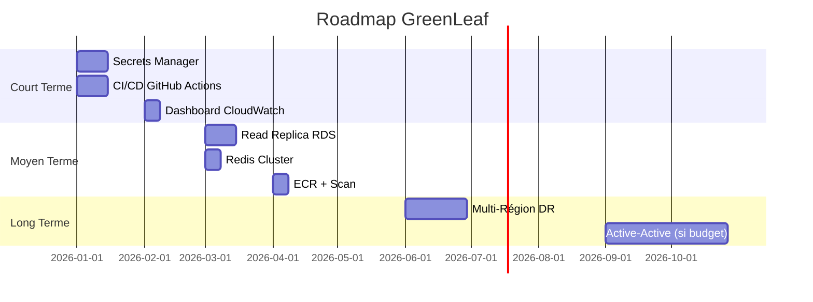

# Améliorations Futures & Architecture Multi-Région

**Projet :** GreenLeaf - Plateforme E-commerce

**Date :** 06 Janvier 2026

**Version :** 1.0

---

## 1. Résumé

Ce document présente les **améliorations possibles** de l'architecture GreenLeaf et explore en détail l'option **Multi-Région** pour le Disaster Recovery et l'expansion géographique.

| Horizon | Améliorations | Impact Budget |
|:--------|:--------------|:--------------|
| **Court terme** (0-3 mois) | Monitoring, Secrets, CI/CD | +20$/mois |
| **Moyen terme** (3-6 mois) | Cache avancé, Read Replicas | +50$/mois |
| **Long terme** (6-12 mois) | Multi-Région DR | +200-400$/mois |

---

## 2. Améliorations Court Terme (Quick Wins)

### 2.1. Gestion des Secrets avec AWS Secrets Manager

**État actuel :** Variables d'environnement dans SSM Parameter Store.

**Amélioration :** Migrer vers Secrets Manager avec rotation automatique.

```hcl
resource "aws_secretsmanager_secret" "db_credentials" {
  name = "greenleaf/prod/db"
}

resource "aws_secretsmanager_secret_rotation" "db" {
  secret_id           = aws_secretsmanager_secret.db_credentials.id
  rotation_lambda_arn = aws_lambda_function.rotate_secret.arn

  rotation_rules {
    automatically_after_days = 30
  }
}
```

**Avantages :**
- Rotation automatique des mots de passe DB
- Intégration native RDS
- Audit trail complet

**Coût :** ~0.40$/secret/mois + 0.05$/10k appels API

---

### 2.2. Pipeline CI/CD Complet

**État actuel :** Déploiement manuel via Terraform.

**Amélioration :** GitHub Actions avec workflow complet.

```yaml
# .github/workflows/deploy.yml
name: Deploy to AWS

on:
  push:
    branches: [main, develop]

jobs:
  test:
    runs-on: ubuntu-latest
    steps:
      - uses: actions/checkout@v4
      - name: Run tests
        run: npm test

  build:
    needs: test
    runs-on: ubuntu-latest
    steps:
      - name: Build Docker image
        run: docker build -t greenleaf/medusa:${{ github.sha }} .
      - name: Push to ECR
        run: |
          aws ecr get-login-password | docker login --username AWS --password-stdin $ECR_URI
          docker push $ECR_URI/medusa:${{ github.sha }}

  deploy-dev:
    needs: build
    if: github.ref == 'refs/heads/develop'
    runs-on: ubuntu-latest
    steps:
      - name: Deploy to DEV
        run: |
          cd terraform
          terraform workspace select dev
          terraform apply -auto-approve -var="image_tag=${{ github.sha }}"

  deploy-prod:
    needs: build
    if: github.ref == 'refs/heads/main'
    runs-on: ubuntu-latest
    environment: production  # Requires manual approval
    steps:
      - name: Deploy to PROD
        run: |
          cd terraform
          terraform workspace select prod
          terraform apply -auto-approve -var="image_tag=${{ github.sha }}"
```

**Avantages :**
- Déploiements reproductibles
- Rollback facile (git revert)
- Approval gates pour la prod

**Coût :** Gratuit (GitHub Actions free tier)

---

### 2.3. Observabilité Avancée

**État actuel :** CloudWatch basique.

**Amélioration :** Stack complète avec dashboards et alertes.

```hcl
resource "aws_cloudwatch_dashboard" "main" {
  dashboard_name = "greenleaf-overview"
  dashboard_body = jsonencode({
    widgets = [
      {
        type   = "metric"
        x      = 0
        y      = 0
        width  = 12
        height = 6
        properties = {
          title   = "EC2 CPU Utilization"
          metrics = [["AWS/EC2", "CPUUtilization", "AutoScalingGroupName", "greenleaf-asg"]]
          period  = 300
          stat    = "Average"
        }
      },
      {
        type   = "metric"
        x      = 12
        y      = 0
        width  = 12
        height = 6
        properties = {
          title   = "RDS Connections"
          metrics = [["AWS/RDS", "DatabaseConnections", "DBInstanceIdentifier", "greenleaf-db"]]
        }
      },
      {
        type   = "metric"
        x      = 0
        y      = 6
        width  = 12
        height = 6
        properties = {
          title   = "ALB Request Count"
          metrics = [["AWS/ApplicationELB", "RequestCount", "LoadBalancer", "app/greenleaf-alb/xxx"]]
        }
      }
    ]
  })
}
```

**Coût :** ~3$/dashboard/mois

---

## 3. Améliorations Moyen Terme

### 3.1. Read Replica RDS

**État actuel :** Une seule instance RDS Multi-AZ.

**Amélioration :** Ajouter un Read Replica pour les requêtes catalogue.

```hcl
resource "aws_db_instance" "replica" {
  identifier          = "greenleaf-replica"
  replicate_source_db = aws_db_instance.main.identifier
  instance_class      = "db.t3.small"
  
  # Pas de Multi-AZ pour le replica (économie)
  multi_az = false
  
  # Pas de backup (le master s'en occupe)
  backup_retention_period = 0
}
```

**Architecture :**
```
┌─────────────────┐     ┌─────────────────┐
│   Medusa App    │     │   Medusa App    │
└────────┬────────┘     └────────┬────────┘
         │ WRITE                 │ READ
         ▼                       ▼
┌─────────────────┐     ┌─────────────────┐
│  RDS Primary    │────▶│  RDS Replica    │
│  (Multi-AZ)     │ sync│  (Single-AZ)    │
└─────────────────┘     └─────────────────┘
```

**Coût :** +~35$/mois (db.t3.small)

---

### 3.2. ElastiCache Redis Cluster Mode

**État actuel :** Redis single-node (cache.t3.micro).

**Amélioration :** Cluster avec réplication pour la HA.

```hcl
resource "aws_elasticache_replication_group" "redis" {
  replication_group_id = "greenleaf-redis"
  description          = "Redis cluster for GreenLeaf"
  
  node_type            = "cache.t3.small"
  num_cache_clusters   = 2  # 1 primary + 1 replica
  
  automatic_failover_enabled = true
  multi_az_enabled          = true
  
  at_rest_encryption_enabled = true
  transit_encryption_enabled = true
  auth_token                 = var.redis_auth_token
}
```

**Avantages :**
- Failover automatique (<60s)
- Capacité doublée (1.5GB → 3GB)

**Coût :** +~25$/mois

---

### 3.3. Container Registry Privé (ECR)

**État actuel :** Images Docker sur Docker Hub ou build local.

**Amélioration :** AWS ECR avec scan de vulnérabilités.

```hcl
resource "aws_ecr_repository" "medusa" {
  name                 = "greenleaf/medusa"
  image_tag_mutability = "IMMUTABLE"

  image_scanning_configuration {
    scan_on_push = true
  }

  encryption_configuration {
    encryption_type = "AES256"
  }
}

resource "aws_ecr_lifecycle_policy" "cleanup" {
  repository = aws_ecr_repository.medusa.name

  policy = jsonencode({
    rules = [{
      rulePriority = 1
      description  = "Keep last 10 images"
      selection = {
        tagStatus   = "any"
        countType   = "imageCountMoreThan"
        countNumber = 10
      }
      action = {
        type = "expire"
      }
    }]
  })
}
```

**Coût :** ~0.10$/GB/mois (gratuit pour les 500 premiers MB)

---

## 4. Architecture Multi-Région

### 4.1. Pourquoi le Multi-Région ?

| Objectif | Multi-AZ (Actuel) | Multi-Région |
|:---------|:------------------|:-------------|
| **Panne d'un datacenter** | ✅ Couvert | ✅ Couvert |
| **Panne de région entière** | ❌ Non couvert | ✅ Couvert |
| **Latence mondiale** | ❌ ~100ms depuis USA | ✅ <50ms partout |
| **Conformité RGPD** | ❌ Données en France | ✅ Données locales |

**Quand passer au Multi-Région ?**
- Chiffre d'affaires > 100k€/mois (coût d'indisponibilité élevé)
- Expansion internationale (USA, Asie)
- Exigences contractuelles (SLA 99.99%)

---

### 4.2. Architecture Multi-Région Passive (Disaster Recovery)

**Objectif :** Reprendre l'activité si Paris tombe (RTO < 2h).

```
┌─────────────────────────────────────────────────────────────┐
│                      Cloudflare DNS                          │
│              (Routage basé sur health checks)                │
└─────────────────┬───────────────────────┬───────────────────┘
                  │ ACTIVE                │ STANDBY
                  ▼                       ▼
┌─────────────────────────┐   ┌─────────────────────────┐
│   AWS Paris (Primary)    │   │  AWS Irlande (DR)       │
│   eu-west-3              │   │  eu-west-1              │
├─────────────────────────┤   ├─────────────────────────┤
│ • ALB + ASG (Running)   │   │ • ALB + ASG (Stopped)   │
│ • RDS Multi-AZ (Active) │──▶│ • RDS Replica (Read)    │
│ • Redis (Active)        │   │ • Redis (Cold)          │
└─────────────────────────┘   └─────────────────────────┘
         │                              ▲
         │      Réplication Async       │
         └──────────────────────────────┘
```

**Configuration Terraform :**

```hcl
# Provider pour la région de DR
provider "aws" {
  alias  = "dr"
  region = "eu-west-1"  # Irlande
}

# Réplication RDS Cross-Region
resource "aws_db_instance_automated_backups_replication" "dr" {
  source_db_instance_arn = aws_db_instance.main.arn
  retention_period       = 7
  
  provider = aws.dr
}

# VPC dans la région DR (infrastructure dormante)
module "networking_dr" {
  source = "./modules/networking"
  providers = {
    aws = aws.dr
  }
  
  environment = "dr"
  # Configuration minimale
}
```

**Procédure de Failover :**

1. Détecter la panne (CloudWatch + Cloudflare Health Check)
2. Promouvoir le RDS Replica en Primary
3. Démarrer l'ASG en Irlande
4. Basculer le DNS Cloudflare

```bash
# Script de failover
#!/bin/bash
# 1. Promouvoir le replica
aws rds promote-read-replica --db-instance-identifier greenleaf-dr --region eu-west-1

# 2. Démarrer les instances
aws autoscaling update-auto-scaling-group \
  --auto-scaling-group-name greenleaf-asg-dr \
  --min-size 2 --desired-capacity 2 \
  --region eu-west-1

# 3. Mettre à jour le DNS (via Cloudflare API)
curl -X PATCH "https://api.cloudflare.com/client/v4/zones/$ZONE_ID/dns_records/$RECORD_ID" \
  -H "Authorization: Bearer $CF_TOKEN" \
  -d '{"content":"alb-irlande.amazonaws.com"}'
```

**Coût estimé :**
| Composant | Coût/mois |
|:----------|:----------|
| RDS Cross-Region Replica (dormant) | ~50$ |
| VPC + NAT Instance (dormant) | ~10$ |
| Stockage EBS (snapshots) | ~5$ |
| **Total DR** | **~65$/mois** |

---

### 4.3. Architecture Multi-Région Active-Active (Global)

**Objectif :** Servir les clients depuis la région la plus proche.

```
                    ┌──────────────────┐
                    │  Cloudflare DNS  │
                    │  (Geo-routing)   │
                    └────────┬─────────┘
           ┌─────────────────┼─────────────────┐
           │                 │                 │
           ▼                 ▼                 ▼
┌──────────────────┐ ┌──────────────────┐ ┌──────────────────┐
│  AWS Paris       │ │  AWS Irlande     │ │  AWS Virginie    │
│  eu-west-3       │ │  eu-west-1       │ │  us-east-1       │
├──────────────────┤ ├──────────────────┤ ├──────────────────┤
│ ALB + ASG        │ │ ALB + ASG        │ │ ALB + ASG        │
│ RDS Primary      │ │ RDS Replica      │ │ RDS Replica      │
│ Redis Cluster    │ │ Redis Cluster    │ │ Redis Cluster    │
└────────┬─────────┘ └────────┬─────────┘ └────────┬─────────┘
         │                    │                    │
         └────────────────────┼────────────────────┘
                              │
                    ┌─────────▼─────────┐
                    │  Aurora Global    │
                    │  Database         │
                    │  (Sync < 1 sec)   │
                    └───────────────────┘
```

**Composants clés :**

1. **Aurora Global Database** (remplace RDS) :
```hcl
resource "aws_rds_global_cluster" "greenleaf" {
  global_cluster_identifier = "greenleaf-global"
  engine                    = "aurora-postgresql"
  engine_version            = "15.4"
  database_name             = "medusa"
}

resource "aws_rds_cluster" "primary" {
  cluster_identifier        = "greenleaf-paris"
  global_cluster_identifier = aws_rds_global_cluster.greenleaf.id
  engine                    = "aurora-postgresql"
  engine_mode               = "provisioned"
  
  # Paris
  availability_zones = ["eu-west-3a", "eu-west-3b"]
}

resource "aws_rds_cluster" "secondary" {
  provider = aws.ireland
  
  cluster_identifier        = "greenleaf-ireland"
  global_cluster_identifier = aws_rds_global_cluster.greenleaf.id
  engine                    = "aurora-postgresql"
  
  # Irlande
  availability_zones = ["eu-west-1a", "eu-west-1b"]
  
  depends_on = [aws_rds_cluster.primary]
}
```

2. **Cloudflare Geo-Routing** :
```
example.com -> Paris     (pour visiteurs EU)
example.com -> Irlande   (pour visiteurs UK)
example.com -> Virginie  (pour visiteurs USA)
```

**Coût estimé :**
| Composant | Paris | Irlande | USA | Total |
|:----------|:------|:--------|:----|:------|
| Compute (ASG) | 60$ | 60$ | 60$ | 180$ |
| Aurora Global | 150$ | 100$ | 100$ | 350$ |
| Redis | 25$ | 25$ | 25$ | 75$ |
| Réseau | 50$ | 50$ | 50$ | 150$ |
| **TOTAL** | | | | **~755$/mois** |

> ⚠️ **Attention :** L'Active-Active dépasse le budget de 500$. C'est une vision long terme.

---

### 4.4. Défis du Multi-Région

| Défi | Solution |
|:-----|:---------|
| **Latence de réplication** | Aurora Global < 1s, acceptable |
| **Conflits d'écriture** | Write-forwarding vers Primary |
| **Coût Data Transfer** | Cloudflare R2 (multi-région natif) |
| **Complexité Terraform** | Modules avec providers multiples |
| **Cohérence des sessions** | Redis Cluster avec réplication |

---

## 5. Roadmap des Améliorations



---

## 6. Récapitulatif des Coûts

| Phase | Amélioration | Coût Additionnel |
|:------|:-------------|:-----------------|
| **V1 Actuelle** | Architecture de base | 305$/mois |
| **+Court terme** | Secrets, CI/CD, Dashboard | +25$/mois |
| **+Moyen terme** | Read Replica, Redis HA | +65$/mois |
| **+DR Passive** | Multi-Région standby | +65$/mois |
| **TOTAL V2** | | **~460$/mois** ✅ |
| **+Active-Active** | (Future expansion) | +400$/mois |
| **TOTAL V3** | | **~860$/mois** ❌ Budget |

---

## 7. Réponses aux Questions du Jury

**Q: "Pourquoi vous n'avez pas fait de Multi-Région ?"**
> "Le Multi-Région coûte au minimum +65$/mois pour le DR passif et +400$/mois pour l'Active-Active. Avec notre budget de 500$, nous avons priorisé la stabilité en Multi-AZ. Le Multi-Région est documenté comme évolution future."

**Q: "Que se passe-t-il si la région Paris tombe ?"**
> "C'est un risque accepté pour le budget actuel. AWS Paris n'a jamais eu de panne régionale complète. Notre RTO serait de 2-4h avec reconstruction Terraform dans une autre région."

**Q: "Comment vous évolueriez vers le Multi-Région ?"**
> "Étape 1 : RDS Cross-Region Replica en read-only (+50$/mois). Étape 2 : Infrastructure DR dormante avec failover manuel. Étape 3 : Aurora Global pour l'Active-Active si le budget le permet."

**Q: "Cloudflare R2 est déjà Multi-Région ?"**
> "Oui, c'est un avantage majeur. Les images produits sont automatiquement répliquées sur le réseau mondial Cloudflare. C'est pour ça qu'on l'a choisi plutôt que S3."

---
