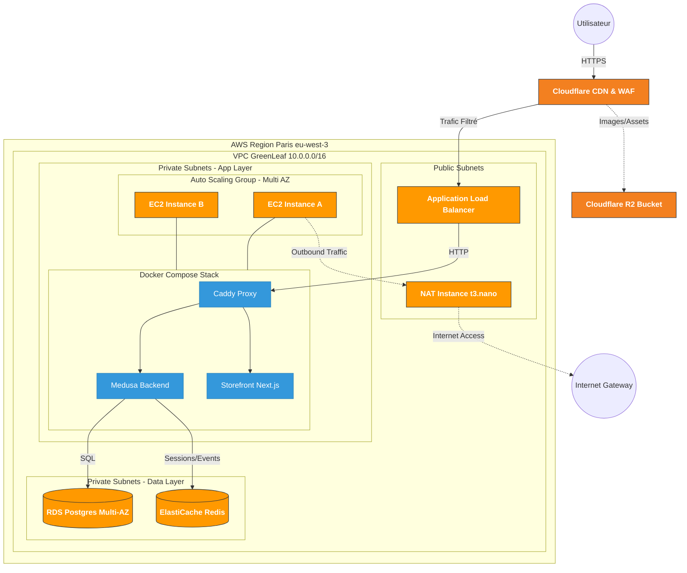

# Document d'Architecture Technique (DAT)

**Projet :** GreenLeaf - Plateforme E-commerce Scalable

**Auteurs :** Équipe GreenLeaf

**Date :** 06 Janvier 2026

**Version :** 1.0

---

## 1. Introduction

Ce document décrit l'architecture cloud déployée pour GreenLeaf, une startup e-commerce. L'objectif est de fournir une plateforme **Haute Disponibilité (HA)**, **scalable** et **sécurisée** tout en respectant un budget strict de **500$/mois**.

L'architecture utilise une approche **hybride (AWS + Cloudflare)** et remplace la stack Magento initialement prévue par **MedusaJS** (Node.js Headless), plus moderne et économe en ressources.

---

## 2. Vue d'Ensemble de l'Architecture

### 2.1. Schéma d'Architecture



### 2.2. Justification des Choix d'Architecture

| Décision | Justification |
|:---------|:--------------|
| **MedusaJS vs Magento** | Réduction de RAM de 4Go à 1Go par instance. Permet l'usage de `t3.small` au lieu de `t3.large`. |
| **Caddy vs Nginx** | Configuration simplifiée (5 lignes vs 50). Réduit le risque d'erreur sur un projet court. |
| **Cloudflare + R2** | WAF gratuit, CDN gratuit, et **0$ de frais Egress** sur R2 (vs ~0.09$/Go sur S3). |
| **NAT Instance vs NAT Gateway** | Économie de **~60$/mois** (4$ vs 66$). |
| **Multi-AZ (Paris A/B)** | Garantit le SLA 99.95% sans le coût du Multi-Région. |

---

## 3. Description Détaillée des Services

### 3.1. Réseau (VPC)

| Paramètre | Valeur |
|:----------|:-------|
| **CIDR Block** | `10.0.0.0/16` |
| **Région** | `eu-west-3` (Paris) |
| **Zones de Disponibilité** | `eu-west-3a`, `eu-west-3b` |

**Sous-réseaux :**

| Nom | CIDR | Type | Zone |
|:----|:-----|:-----|:-----|
| Public A | `10.0.1.0/24` | Public | eu-west-3a |
| Public B | `10.0.2.0/24` | Public | eu-west-3b |
| Private App A | `10.0.10.0/24` | Privé | eu-west-3a |
| Private App B | `10.0.20.0/24` | Privé | eu-west-3b |
| Private Data A | `10.0.100.0/24` | Privé | eu-west-3a |
| Private Data B | `10.0.200.0/24` | Privé | eu-west-3b |

**Tables de Routage :**
- **Publique** : `0.0.0.0/0` → Internet Gateway
- **Privée A** : `0.0.0.0/0` → NAT Instance A (eni-xxx)
- **Privée B** : `0.0.0.0/0` → NAT Instance B (eni-xxx)

**NAT Instance (FinOps) :**
- Type : `t3.nano` (2x instances, une par AZ)
- Configuration : `source_dest_check = false` + script `iptables` (IP Masquerade)
- Coût : **~8$/mois** (vs 66$ pour NAT Gateway)

---

### 3.2. Calcul (EC2 & Auto Scaling)

| Paramètre | Valeur |
|:----------|:-------|
| **Type d'instance** | `t3.small` (2 vCPU, 2GB RAM) |
| **AMI** | Amazon Linux 2023 |
| **Capacité Min/Max/Desired** | 2 / 4 / 2 |
| **Politique de Scaling** | Target Tracking : CPU > 60% |

**User Data (Configuration au démarrage) :**
```bash
#!/bin/bash
dnf update -y
dnf install -y docker git
systemctl enable docker && systemctl start docker
curl -L "https://github.com/docker/compose/releases/latest/download/docker-compose-$(uname -s)-$(uname -m)" -o /usr/local/bin/docker-compose
chmod +x /usr/local/bin/docker-compose
git clone https://github.com/greenleaf/app.git /opt/app
cd /opt/app && docker-compose up -d
```

---

### 3.3. Équilibrage de Charge (ALB)

| Paramètre | Valeur |
|:----------|:-------|
| **Type** | Application Load Balancer |
| **Listeners** | HTTP:80 (HTTPS terminé par Cloudflare) |
| **Target Group** | Protocol HTTP, Port 80 |
| **Health Check** | Path `/health`, Interval 30s, Threshold 2 |

**Security Group ALB :**
- Inbound : TCP 80 depuis les **IPs Cloudflare uniquement**
- Outbound : TCP 80 vers le Security Group des EC2

---

### 3.4. Base de Données (RDS PostgreSQL)

| Paramètre | Valeur |
|:----------|:-------|
| **Moteur** | PostgreSQL 15.x |
| **Type d'instance** | `db.t3.medium` (2 vCPU, 4GB RAM) |
| **Multi-AZ** | ✅ Activé (PROD) / ❌ Désactivé (DEV/PREPROD) |
| **Stockage** | 20 Go gp3, Auto-scaling up to 100 Go |
| **Backup** | Retention 7 jours, Fenêtre 03:00-04:00 UTC |

**Security Group RDS :**
- Inbound : TCP 5432 depuis le SG des EC2 App uniquement

---

### 3.5. Cache (ElastiCache Redis)

| Paramètre | Valeur |
|:----------|:-------|
| **Moteur** | Redis 7.x |
| **Type de nœud** | `cache.t3.micro` |
| **Cluster Mode** | Désactivé (Single Node) |

**Cas d'usage :**
- Stockage des **sessions utilisateurs** (stateless EC2)
- File d'attente d'**événements Medusa** (jobs async)

---

### 3.6. Stockage (Cloudflare R2)

| Paramètre | Valeur |
|:----------|:-------|
| **Service** | Cloudflare R2 (Compatible S3 API) |
| **Bucket** | `greenleaf-media` |
| **Accès Public** | Via domaine Cloudflare (CDN intégré) |

**Justification :**
- **0$ de frais Egress** (vs ~0.09$/Go sur AWS S3)
- Intégration native avec le CDN Cloudflare

---

### 3.7. CDN & Sécurité (Cloudflare)

| Paramètre | Valeur |
|:----------|:-------|
| **Plan** | Free / Pro |
| **SSL Mode** | Full (Strict) |
| **WAF** | Règles OWASP activées |
| **Cache** | Statique : 1 mois, Dynamique : bypass |

---

## 4. Sécurité

### 4.1. Groupes de Sécurité

| Security Group | Inbound | Outbound |
|:---------------|:--------|:---------|
| **SG-ALB** | TCP 80 depuis IPs Cloudflare | TCP 80 vers SG-App |
| **SG-App** | TCP 80 depuis SG-ALB | TCP 5432 vers SG-RDS, TCP 6379 vers SG-Redis, All vers NAT |
| **SG-RDS** | TCP 5432 depuis SG-App | Aucun |
| **SG-Redis** | TCP 6379 depuis SG-App | Aucun |
| **SG-NAT** | All TCP/UDP depuis VPC CIDR | All vers 0.0.0.0/0 |

### 4.2. Gestion des Identités (IAM)

| Rôle | Permissions | Usage |
|:-----|:------------|:------|
| `EC2-App-Role` | `ssm:StartSession`, `logs:PutLogEvents` | Connexion SSM, Logs CloudWatch |
| `Lambda-Scheduler-Role` | `rds:Stop*`, `rds:Start*` | Arrêt/Démarrage RDS Preprod |

### 4.3. Sécurité des Données

- **Chiffrement au repos** : RDS (AES-256), EBS (AES-256), R2 (AES-256)
- **Chiffrement en transit** : HTTPS (TLS 1.3) via Cloudflare, Postgres SSL

---

## 5. Monitoring et Logging

| Service | Métriques / Logs |
|:--------|:-----------------|
| **CloudWatch Metrics** | CPUUtilization, DatabaseConnections, NetworkIn/Out |
| **CloudWatch Alarms** | CPU > 80% (5 min), RDS Connections > 100 |
| **CloudWatch Logs** | `/var/log/messages`, Docker stdout |

**Alertes configurées :**
- Email si CPU EC2 > 80% pendant 5 minutes
- Email si Budget AWS > 80% (400$)

---
